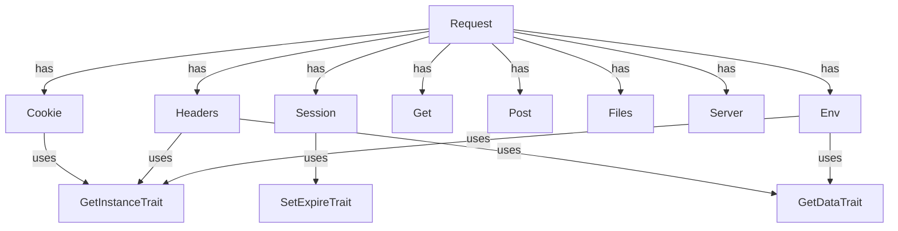

# CloudCastle HttpRequest

[](coverage-report/index.html)
[](https://github.com/zorinalexey/cloud-castle-http-request/actions)
[](https://phpstan.org/)
[](LICENSE)
[](https://packagist.org/packages/cloud-castle/http-request)
---

[Русский](README.md) | [English](README.en.md) | [Français](README.fr.md)
---

**CloudCastle HttpRequest** — eine moderne PHP-Bibliothek für bequeme, sichere und erweiterbare Arbeit mit HTTP-Anfragen, Sessions, Cookies, Dateien, Headern, Servervariablen und Umgebungsvariablen. Unterstützt automatische JSON- und XML-Analyse, Singleton-Pattern, magische Methoden, globale Hilfsfunktionen und ist vollständig durch Tests abgedeckt.

---

## 🧪 Test- und Abdeckungsstatistiken

- **PHPUnit**: 163 Tests, 194 Assertions, 2 übersprungen
- **Zeilenabdeckung**: 90,43% (624 / 690)
- **Methodenabdeckung**: 73,33% (44 / 60)
- **Klassenabdeckung**: 61,54% (8 / 13)
- **Letzter Lauf**: 2025-06-29
- **Durchschnittliche Testlaufzeit**: ~0,5 Sek

<details>
<summary>Abdeckung nach Verzeichnissen</summary>

| Verzeichnis   | Zeilen | Methoden | Klassen |
|--------------|--------|----------|---------|
| Http         | 82,79% (101/122) | 83,87% (26/31) | 57,14% (4/7) |
| Server       | 70,83% (17/24)   | 75,00% (3/4)   | 50,00% (1/2) |
| Traits       | 100,00% (17/17)  | 100,00% (6/6)  | 100,00% (3/3) |
| helpers      | 0,00% (0/34)     | 0,00% (0/8)    | — |

## 🧪 Detaillierte Abdeckungsstatistik nach Klassen

| Klasse                      | Zeilen         | Methoden        | Öffentliche Methoden | Methodenabdeckung |
|-----------------------------|----------------|-----------------|---------------------|-------------------|
| **Cookie**                  | 100% (20/20)   | 100% (7/7)      | 7/7                 | 100%              |
| **Get**                     | 100% (4/4)     | 100% (1/1)      | 1/1                 | 100%              |
| **Post**                    | 100% (4/4)     | 100% (1/1)      | 1/1                 | 100%              |
| **Files**                   | 100% (15/15)   | 100% (1/1)      | 1/1                 | 100%              |
| **Headers**                 | 91% (21/23)    | 67% (2/3)       | 2/3                 | 67%               |
| **Session**                 | 78% (25/32)    | 67% (6/9)       | 6/9                 | 67%               |
| **UploadFile**              | 50% (12/24)    | 89% (8/9)       | 8/9                 | 89%               |
| **Server**                  | 100% (4/4)     | 100% (1/1)      | 1/1                 | 100%              |
| **Env**                     | 65% (13/20)    | 67% (2/3)       | 2/3                 | 67%               |

**Nicht abgedeckte öffentliche Methoden (laut dashboard.html):**
- UploadFile::save — 14% abgedeckt
- Session::__set, __get — 0% abgedeckt
- Headers::__construct — 87% abgedeckt (teilweise)
- Env::__set — 53% abgedeckt
- (und andere, siehe dashboard.html)


</details>

---

## 📎 Schnelle Links
- [Dokumentation](#detailliertes-api)
- [Beispiele](#anwendungsbeispiele)
- [Architektur](#architektur-und-komponenten)
- [FAQ](#faq-und-troubleshooting)
- [Changelog](CHANGELOG.md)
- [Issues](https://github.com/zorinalexey/Http-Request/issues)
- [Pull Requests](https://github.com/zorinalexey/Http-Request/pulls)

---

## ⚙️ Anforderungen
- PHP >= 8.3
- Erweiterungen: ext-json, ext-mbstring
- Kompatibilität: jedes Framework, PSR-4 Unterstützung

---

## 🚀 CI/CD Workflow (GitHub Actions)
```yaml
name: CI

on:
  push:
    branches: [ main, master ]
  pull_request:
    branches: [ main, master ]

jobs:
  build:
    runs-on: ubuntu-latest
    strategy:
      matrix:
        php-version: [ '8.3', '8.4' ]
    steps:
      - name: Checkout code
        uses: actions/checkout@v4

      - name: Set up PHP
        uses: shivammathur/setup-php@v2
        with:
          php-version: ${{ matrix.php-version }}
          extensions: mbstring, xml, simplexml, curl, json, session
          coverage: xdebug

      - name: Install dependencies
        run: composer install --no-interaction

      - name: Run tests
        run: composer test

      - name: Run static analysis
        run: composer phpstan

      - name: Coverage (text)
        run: composer coverage

      - name: Coverage (HTML)
        run: composer coverage-html

      - name: Generate documentation
        run: composer docs-gen

      - name: Upload coverage report
        uses: actions/upload-artifact@v4
        with:
          name: coverage-report
          path: coverage-report/

      - name: Upload documentation
        uses: actions/upload-artifact@v4
        with:
          name: documentation
          path: build/api/ 
```

---

## 🗺️ Architektur (Mermaid)


---

## 📋 Inhalt
- [Funktionen](#funktionen)
- [Installation](#installation)
- [Schnellstart](#schnellstart)
- [Architektur und Komponenten](#architektur-und-komponenten)
- [Detailliertes API](#detailliertes-api)
- [Anwendungsbeispiele](#anwendungsbeispiele)
- [Hilfsfunktionen](#hilfsfunktionen)
- [Framework-Integration](#framework-integration)
- [Tests](#tests)
- [FAQ](#faq)
- [Lizenz und Kontakte](#lizenz-und-kontakte)

---

## 🚀 Funktionen
- Universeller Zugriff auf Anfragedaten: GET, POST, COOKIE, SESSION, FILES, HEADERS, SERVER, ENV
- Automatische Analyse von JSON- und XML-Anfragekörpern
- Bequeme Arbeit mit Cookies und Sessions (Singleton, Method Chaining, Serialisierung)
- Sichere Handhabung hochgeladener Dateien
- Globale Funktionen für schnellen Datenzugriff
- Flexible Konfiguration der Lebensdauer von Sessions und Cookies
- Kompatibel mit modernen PHP-Standards (8.1+)
- Vollständig durch Tests abgedeckt (PHPUnit)
- Erweiterbar und integrierbar mit allen Frameworks

---

## 📦 Installation

### Über Composer (empfohlen)
```bash
composer require cloud-castle/http-request
```

### Manuelle Installation
```bash
git clone https://github.com/zorinalexey/cloud-castle-http-request
cd http-request
composer install
```

---

## ⚡ Schnellstart

```php
<?php
require_once 'vendor/autoload.php';

use CloudCastle\HttpRequest\Request;

// Singleton Request erhalten
$request = Request::getInstance();

// Anfrageparameter abrufen
$userId = $request->get('user_id');
$session = $request->session;
$all = $request->all();

// POST/GET/COOKIE/FILES/HEADERS abrufen
$post = $request->post;
$get = $request->get;
$cookie = $request->cookie;
$files = $request->files;
$headers = $request->headers;
```

---

## 🏗️ Architektur und Komponenten

- **Request** — Haupt-Fassade für den Zugriff auf alle Anfragedaten.
- **Get/Post** — Zugriff auf GET/POST-Daten.
- **Cookie** — Cookie-Verwaltung (Setzen, Abrufen, Löschen, Leeren).
- **Session** — Sitzungsverwaltung.
- **Files/UploadFile** — Arbeit mit hochgeladenen Dateien.
- **Headers** — Arbeit mit HTTP-Headern.
- **Server/Env** — Zugriff auf Server- und Umgebungsvariablen.
- **Hilfsfunktionen**: `request()`, `cookies()`, `session()`, `files()`, `headers()`, `get()`, `post()`, `env()`.

---

## 📚 Detailliertes API

### Request
| Methode                | Beschreibung                                  |
|-----------------------|-----------------------------------------------|
| getInstance()         | Singleton Request erhalten                    |
| init($sess, $cook)    | Initialisierung mit TTL für Session und Cookie|
| get($key, $def)       | Parameter nach Schlüssel abrufen              |
| all()                 | Alle Anfragedaten abrufen                     |
| __get($name)          | Magischer Zugriff auf Komponenten             |

### Cookie
| Methode                | Beschreibung                                  |
|-----------------------|-----------------------------------------------|
| set($key, $val)       | Cookie setzen                                 |
| get($key, $def)       | Cookie abrufen                                |
| delete($key)          | Cookie löschen                                |
| clear()               | Alle Cookies leeren                           |

### Session
| Methode                | Beschreibung                                  |
|-----------------------|-----------------------------------------------|
| set($key, $val)       | Wert in Session setzen                        |
| get($key, $def)       | Wert aus Session abrufen                      |
| delete($key)          | Wert aus Session löschen                      |
| clear()               | Session leeren                                |

### Files/UploadFile
| Methode                | Beschreibung                                  |
|-----------------------|-----------------------------------------------|
| get($name)            | Datei nach Name abrufen                       |
| all()                 | Alle Dateien abrufen                          |
| isUploaded()          | Prüfen, ob Datei hochgeladen wurde            |
| save($path)           | Datei speichern                               |
| getOriginalName()     | Ursprünglicher Dateiname                      |
| getSize()             | Dateigröße                                    |
| getMimeType()         | MIME-Typ der Datei                            |
| getExtension()        | Dateierweiterung                              |

### Headers
| Methode                | Beschreibung                                  |
|-----------------------|-----------------------------------------------|
| get($name, $def)      | Header abrufen                                |
| all()                 | Alle Header abrufen                           |
| __set($name, $val)    | Header setzen                                 |

### Server/Env
| Methode                | Beschreibung                                  |
|-----------------------|-----------------------------------------------|
| get($name, $def)      | Server-/Umgebungsvariable abrufen             |
| all()                 | Alle Variablen abrufen                        |

---

## 💡 Anwendungsbeispiele

### Globale Funktion `request()`
```php
// Parameter aus beliebiger Quelle (GET, POST, ...) oder Request-Objekt abrufen
$id = request('id');
$name = request('name', 'default_name');
$request = request();

// Alle Anfragedaten abrufen
$all = request()->all();

// Arbeit mit Dateien
$avatar = request()->files('avatar');
if ($avatar && $avatar->isUploaded()) {
    $avatar->save('/uploads/avatars/');
}

// Arbeit mit Cookies
request()->cookie->set('token', 'abc123');
$token = request()->cookie->get('token');

// Arbeit mit Session
request()->session->set('user_id', 42);
$userId = request()->session->get('user_id');
```

### Arbeit mit Headern
```php
$headers = request()->headers;
$userAgent = $headers->get('User-Agent');
$headers->X_Custom_Header = 'custom_value';
```

### Arbeit mit JSON und XML
```php
// Wenn Content-Type: application/json
$data = request()->all(); // wird automatisch in ein Array umgewandelt

// Wenn Content-Type: application/xml
$data = request()->all(); // wird automatisch in ein Array umgewandelt
```

### Arbeit mit GET/POST
```php
$get = request()->get;
$post = request()->post;

$name = $get->get('name');
$email = $post->get('email');
```

### Arbeit mit Servervariablen und Umgebung
```php
$server = request()->server;
$env = request()->env;

$host = $server->get('HTTP_HOST');
$phpVersion = $env->get('PHP_VERSION');
```

### Arbeit mit UploadFile
```php
$file = request()->files('avatar');
if ($file && $file->isUploaded()) {
    $file->save('/uploads/avatars/');
    echo $file->getOriginalName();
    echo $file->getSize();
    echo $file->getMimeType();
}
```

---

## 🛠️ Hilfsfunktionen

- `request($key = null, $default = null)` — universeller Zugriff auf Anfragedaten
- `cookies($key = null, $default = null)` — Zugriff auf Cookies
- `session($key = null, $default = null)` — Zugriff auf Session
- `files($key = null)` — Zugriff auf hochgeladene Dateien
- `headers($key = null, $default = null)` — Zugriff auf Header
- `get($key = null, $default = null)` — Zugriff auf GET
- `post($key = null, $default = null)` — Zugriff auf POST
- `env($key = null, $default = null)` — Zugriff auf Umgebungsvariablen

---

## 🌐 Framework-Integration
### Laravel
```php
use CloudCastle\HttpRequest\Request;
$request = Request::getInstance();
$userId = $request->get('user_id');
```

### Symfony
```php
use CloudCastle\HttpRequest\Request;
$request = Request::getInstance();
$headers = $request->headers;
```

### Slim
```php
use CloudCastle\HttpRequest\Request;
$app->post('/api', function ($req, $res, $args) {
    $request = Request::getInstance();
    $data = $request->all();
    // ...
});
```

---

## 🧪 Tests

```bash
composer install
vendor/bin/phpunit --testdox
```

---

## ❓ FAQ und Troubleshooting
- **F:** Warum sind neue Umgebungsvariablen nicht sichtbar?  
  **A:** Verwenden Sie `$env->get('VAR')` nach dem Setzen und stellen Sie sicher, dass die Variable in $_ENV vorhanden ist.
- **F:** Wie kann ich einen neuen Content-Type unterstützen?  
  **A:** Fügen Sie ihn dem Array `Request::$contentTypes` hinzu.
- **F:** Wie kann ich Datei-Uploads testen?  
  **A:** Verwenden Sie Mock-Objekte und überschreiben Sie $_FILES in den Tests.
- **F:** Wie kann ich das Singleton zurücksetzen?  
  **A:** Verwenden Sie die Methode `resetInstance()` für die gewünschte Klasse.

---

## 🚦 Performance & Sicherheit
- Verwenden Sie HTTPS für die Arbeit mit Cookies und Sessions.
- Speichern Sie keine sensiblen Daten in Cookies.
- Deaktivieren Sie detaillierte Fehler im Produktivbetrieb.
- Verwenden Sie statische Analyse und Testabdeckung zur Qualitätsverbesserung.

---

## 🤝 Beitrag leisten
- Forken Sie das Repository, erstellen Sie einen Branch, senden Sie einen PR.
- Halten Sie sich an PSR-12, schreiben Sie Tests für neue Features.
- Alle Änderungen müssen CI/CD bestehen.
- Für Fehler — erstellen Sie ein Issue mit einer detaillierten Beschreibung.

---

## 📝 Changelog
Siehe [CHANGELOG.md](CHANGELOG.md) für die Änderungshistorie.

---

## 📬 Kontakte und Support
- E-Mail: [zorinalexey59292@gmail.com](mailto:zorinalexey59292@gmail.com)
- Telegram: [@CloudCastle85](https://t.me/CloudCastle85)
- Issues: https://github.com/zorinalexey/Http-Request/issues

---

## 📄 Lizenz
MIT-Lizenz. Siehe [LICENSE](LICENSE).

---

## 📝 Lizenz und Kontakte

MIT © Alexey Zorin ([zorinalexey59292@gmail.com](mailto:zorinalexey59292@gmail.com))

- [Projekt auf GitHub](https://github.com/zorinalexey/cloud-castle-http-request)
- [Fragen und Vorschläge](mailto:zorinalexey59292@gmail.com)

---

**CloudCastle HttpRequest** — Ihr universelles Werkzeug für die Arbeit mit HTTP in PHP! 