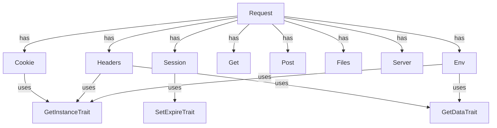

# CloudCastle HttpRequest

[Русский](README.md) | [English](README.en.md)

---

[](coverage-report/index.html)
[](https://github.com/zorinalexey/cloud-castle-http-request/actions)
[](https://phpstan.org/)
[](https://github.com/zorinalexey/cloud-castle-http-request/blob/main/LICENSE)
[](https://packagist.org/packages/cloud-castle/http-request)
---

**CloudCastle HttpRequest** ist eine moderne PHP-Bibliothek für bequeme, sichere und erweiterbare Arbeit mit HTTP-Anfragen, Sessions, Cookies, Dateien, Headern, Server- und Umgebungsvariablen. Unterstützt automatische JSON- und XML-Analyse, Singleton-Pattern, magische Methoden, globale Hilfsfunktionen und ist vollständig getestet.

---

## 📎 Schnelle Links
- [Dokumentation](#detailliertes-api)
- [Beispiele](#anwendungsbeispiele)
- [Architektur](#architektur-und-komponenten)
- [FAQ](#faq-und-troubleshooting)
- [Changelog](CHANGELOG.md)
- [Issues](https://github.com/zorinalexey/Http-Request/issues)
- [Pull Requests](https://github.com/zorinalexey/Http-Request/pulls)

---

## ⚙️ Anforderungen
- PHP >= 8.1
- Erweiterungen: ext-json, ext-mbstring
- Kompatibel mit jedem Framework, PSR-4 Unterstützung

---

## 🚀 CI/CD Workflow (GitHub Actions)
```yaml
name: CI
on: [push, pull_request]
jobs:
  build:
    runs-on: ubuntu-latest
    steps:
      - uses: actions/checkout@v3
      - name: Setup PHP
        uses: shivammathur/setup-php@v2
        with:
          php-version: '8.1'
          extensions: mbstring, json
      - name: Install dependencies
        run: composer install --no-interaction
      - name: Run tests
        run: composer test
      - name: Run static analysis
        run: composer phpstan
      - name: Coverage (text)
        run: composer coverage
      - name: Coverage (HTML)
        run: composer coverage-html
```

---

## 🗺️ Architektur (Mermaid)


---

## 📋 Inhalt
- [Funktionen](#funktionen)
- [Installation](#installation)
- [Schnellstart](#schnellstart)
- [Architektur und Komponenten](#architektur-und-komponenten)
- [Detailliertes API](#detailliertes-api)
- [Anwendungsbeispiele](#anwendungsbeispiele)
- [Hilfsfunktionen](#hilfsfunktionen)
- [Framework-Integration](#framework-integration)
- [Tests](#tests)
- [FAQ](#faq)
- [Lizenz & Kontakte](#lizenz--kontakte)

---

## 🚀 Funktionen
- Einheitlicher Zugriff auf Anfragedaten: GET, POST, COOKIE, SESSION, FILES, HEADERS, SERVER, ENV
- Automatische JSON- und XML-Analyse
- Bequeme Arbeit mit Cookies und Sessions (Singleton, Chaining, Serialisierung)
- Sichere Dateiuploads
- Globale Hilfsfunktionen für schnellen Zugriff
- Flexible Lebensdauer für Session und Cookies
- Kompatibel mit modernen PHP-Standards (8.1+)
- Vollständige Testabdeckung (PHPUnit)
- Erweiterbar und integrierbar in jedes Framework

---

## 📦 Installation

### Über Composer (empfohlen)
```bash
composer require cloud-castle/http-request
```

### Manuelle Installation
```bash
git clone https://github.com/zorinalexey/cloud-castle-http-request
cd http-request
composer install
```

---

## ⚡ Schnellstart

```php
<?php
require_once 'vendor/autoload.php';

use CloudCastle\HttpRequest\Request;

// Singleton Request erhalten
$request = Request::getInstance();

// Anfrageparameter erhalten
$userId = $request->get('user_id');
$session = $request->session;
$all = $request->all();

// POST/GET/COOKIE/FILES/HEADERS erhalten
$post = $request->post;
$get = $request->get;
$cookie = $request->cookie;
$files = $request->files;
$headers = $request->headers;
```

---

## 🏗️ Architektur und Komponenten

- **Request** — Haupt-Fassade für den Zugriff auf alle Anfragedaten.
- **Get/Post** — Zugriff auf GET/POST-Daten.
- **Cookie** — Cookie-Management (setzen, lesen, löschen, leeren).
- **Session** — Session-Management.
- **Files/UploadFile** — Dateiuploads.
- **Headers** — HTTP-Header-Management.
- **Server/Env** — Zugriff auf Server- und Umgebungsvariablen.
- **Hilfsfunktionen**: `request()`, `cookies()`, `session()`, `files()`, `headers()`, `get()`, `post()`, `env()`.

---

## 📚 Detailliertes API

### Request
| Methode               | Beschreibung                                   |
|-----------------------|-----------------------------------------------|
| getInstance()         | Singleton Request erhalten                    |
| init($sess, $cook)    | Initialisierung mit TTL für Session und Cookie|
| get($key, $def)       | Parameter nach Schlüssel erhalten             |
| all()                 | Alle Anfragedaten erhalten                    |
| __get($name)          | Magischer Zugriff auf Komponenten             |

### Cookie
| Methode               | Beschreibung                                   |
|-----------------------|-----------------------------------------------|
| set($key, $val)       | Cookie setzen                                 |
| get($key, $def)       | Cookie lesen                                  |
| delete($key)          | Cookie löschen                                |
| clear()               | Alle Cookies löschen                          |

### Session
| Methode               | Beschreibung                                   |
|-----------------------|-----------------------------------------------|
| set($key, $val)       | Wert in Session setzen                        |
| get($key, $def)       | Wert aus Session lesen                        |
| delete($key)          | Wert aus Session löschen                      |
| clear()               | Session leeren                                |

### Files/UploadFile
| Methode               | Beschreibung                                   |
|-----------------------|-----------------------------------------------|
| get($name)            | Datei nach Name erhalten                      |
| all()                 | Alle Dateien erhalten                         |
| isUploaded()          | Prüfen, ob Datei hochgeladen wurde            |
| save($path)           | Datei speichern                               |
| getOriginalName()     | Ursprünglicher Dateiname                      |
| getSize()             | Dateigröße                                    |
| getMimeType()         | MIME-Typ der Datei                            |
| getExtension()        | Dateierweiterung                              |

### Headers
| Methode               | Beschreibung                                   |
|-----------------------|-----------------------------------------------|
| get($name, $def)      | Header lesen                                  |
| all()                 | Alle Header erhalten                          |
| __set($name, $val)    | Header setzen                                 |

### Server/Env
| Methode               | Beschreibung                                   |
|-----------------------|-----------------------------------------------|
| get($name, $def)      | Server-/Umgebungsvariable lesen               |
| all()                 | Alle Variablen erhalten                       |

---

## 💡 Anwendungsbeispiele

### Globale Funktion `request()`
```php
// Parameter aus beliebiger Quelle (GET, POST, ...) oder Request-Objekt erhalten
$id = request('id');
$name = request('name', 'default_name');
$request = request();

// Alle Anfragedaten erhalten
$all = request()->all();

// Dateiuploads
$avatar = request()->files('avatar');
if ($avatar && $avatar->isUploaded()) {
    $avatar->save('/uploads/avatars/');
}

// Cookies
request()->cookie->set('token', 'abc123');
$token = request()->cookie->get('token');

// Session
request()->session->set('user_id', 42);
$userId = request()->session->get('user_id');
```

### Header
```php
$headers = request()->headers;
$userAgent = $headers->get('User-Agent');
$headers->X_Custom_Header = 'custom_value';
```

### JSON und XML
```php
// Wenn Content-Type: application/json
$data = request()->all(); // wird automatisch in ein Array umgewandelt

// Wenn Content-Type: application/xml
$data = request()->all(); // wird automatisch in ein Array umgewandelt
```

### GET/POST
```php
$get = request()->get;
$post = request()->post;

$name = $get->get('name');
$email = $post->get('email');
```

### Server- und Umgebungsvariablen
```php
$server = request()->server;
$env = request()->env;

$host = $server->get('HTTP_HOST');
$phpVersion = $env->get('PHP_VERSION');
```

### UploadFile
```php
$file = request()->files('avatar');
if ($file && $file->isUploaded()) {
    $file->save('/uploads/avatars/');
    echo $file->getOriginalName();
    echo $file->getSize();
    echo $file->getMimeType();
}
```

---

## 🛠️ Hilfsfunktionen

- `request($key = null, $default = null)` — universeller Zugriff auf Anfragedaten
- `cookies($key = null, $default = null)` — Zugriff auf Cookies
- `session($key = null, $default = null)` — Zugriff auf Session
- `files($key = null)` — Zugriff auf hochgeladene Dateien
- `headers($key = null, $default = null)` — Zugriff auf Header
- `get($key = null, $default = null)` — Zugriff auf GET
- `post($key = null, $default = null)` — Zugriff auf POST
- `env($key = null, $default = null)` — Zugriff auf Umgebungsvariablen

---

## 🌐 Framework-Integration
### Laravel
```php
use CloudCastle\HttpRequest\Request;
$request = Request::getInstance();
$userId = $request->get('user_id');
```

### Symfony
```php
use CloudCastle\HttpRequest\Request;
$request = Request::getInstance();
$headers = $request->headers;
```

### Slim
```php
use CloudCastle\HttpRequest\Request;
$app->post('/api', function ($req, $res, $args) {
    $request = Request::getInstance();
    $data = $request->all();
    // ...
});
```

---

## 🧪 Tests

```bash
composer install
vendor/bin/phpunit --testdox
```

---

## ❓ FAQ und Troubleshooting
- **F:** Warum sind neue Umgebungsvariablen nicht sichtbar?  
  **A:** Verwenden Sie `$env->get('VAR')` nach dem Setzen, stellen Sie sicher, dass die Variable in $_ENV ist.
- **F:** Wie kann ich einen neuen Content-Type unterstützen?  
  **A:** Fügen Sie ihn dem Array `Request::$contentTypes` hinzu.
- **F:** Wie teste ich Dateiuploads?  
  **A:** Verwenden Sie Mock-Objekte und überschreiben Sie $_FILES in Tests.
- **F:** Wie setze ich den Singleton zurück?  
  **A:** Verwenden Sie die Methode `resetInstance()` für die gewünschte Klasse.

---

## 🚦 Performance & Sicherheit
- Verwenden Sie HTTPS für Cookies und Sessions.
- Speichern Sie keine sensiblen Daten in Cookies.
- Deaktivieren Sie detaillierte Fehler im Produktivbetrieb.
- Verwenden Sie statische Analyse und Testabdeckung zur Qualitätssteigerung.

---

## 🤝 Mitwirken
- Forken Sie das Repository, erstellen Sie einen Branch, senden Sie einen PR.
- Halten Sie sich an PSR-12, schreiben Sie Tests für neue Features.
- Alle Änderungen müssen CI/CD bestehen.
- Für Fehler — erstellen Sie ein Issue mit Details.

---

## 📝 Changelog
Siehe [CHANGELOG.md](CHANGELOG.md) für die Änderungshistorie.

---

## 📬 Kontakte & Support
- E-Mail: [zorinalexey59292@gmail.com](mailto:zorinalexey59292@gmail.com)
- Telegram: [@CloudCastle85](https://t.me/CloudCastle85)
- Issues: https://github.com/zorinalexey/Http-Request/issues

---

## 📄 Lizenz
MIT-Lizenz. Siehe [LICENSE](LICENSE).

---

## 🌍 Русская Version
Siehe [README.md](README.md) für die russische Dokumentation.

## 🌍 English Version
See [README.en.md](README.en.md) for English documentation.

---

## 📝 Lizenz & Kontakte

MIT © Alexey Zorin ([zorinalexey59292@gmail.com](mailto:zorinalexey59292@gmail.com))

- [Projekt auf GitHub](https://github.com/zorinalexey/cloud-castle-http-request)
- [Fragen & Vorschläge](mailto:zorinalexey59292@gmail.com)

---

**CloudCastle HttpRequest** — Ihr universelles Werkzeug für HTTP in PHP! 