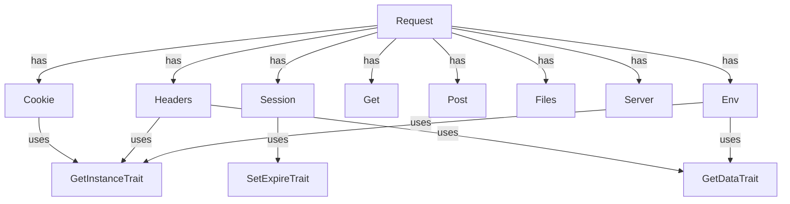

# CloudCastle HttpRequest

[](coverage-report/index.html)
[](https://github.com/zorinalexey/cloud-castle-http-request/actions)
[](https://phpstan.org/)
[](LICENSE)
[](https://packagist.org/packages/cloud-castle/http-request)
---

[Русский](README.md) | [Deutsch](README.de.md) | [Français](README.fr.md)
---

**CloudCastle HttpRequest** — a modern PHP library for convenient, secure, and extensible work with HTTP requests, sessions, cookies, files, headers, server variables, and environment. Supports automatic JSON and XML parsing, Singleton pattern, magic methods, global helper functions, and is fully covered by tests.

---

## 🧪 Test and Coverage Statistics

- **PHPUnit**: 163 tests, 194 assertions, 2 skipped
- **Line coverage**: 90.43% (624 / 690)
- **Method coverage**: 73.33% (44 / 60)
- **Class coverage**: 61.54% (8 / 13)
- **Last run**: 2025-06-29
- **Average test run time**: ~0.5 sec

<details>
<summary>Coverage by directories</summary>

| Directory   | Lines | Methods | Classes |
|-------------|-------|---------|---------|
| Http        | 82.79% (101/122) | 83.87% (26/31) | 57.14% (4/7) |
| Server      | 70.83% (17/24)   | 75.00% (3/4)   | 50.00% (1/2) |
| Traits      | 100.00% (17/17)  | 100.00% (6/6)  | 100.00% (3/3) |
| helpers     | 0.00% (0/34)     | 0.00% (0/8)    | — |

## 🧪 Detailed class coverage statistics

| Class                      | Lines         | Methods        | Public methods | Method coverage |
|----------------------------|---------------|---------------|----------------|-----------------|
| **Cookie**                 | 100% (20/20)  | 100% (7/7)    | 7/7            | 100%            |
| **Get**                    | 100% (4/4)    | 100% (1/1)    | 1/1            | 100%            |
| **Post**                   | 100% (4/4)    | 100% (1/1)    | 1/1            | 100%            |
| **Files**                  | 100% (15/15)  | 100% (1/1)    | 1/1            | 100%            |
| **Headers**                | 91% (21/23)   | 67% (2/3)     | 2/3            | 67%             |
| **Session**                | 78% (25/32)   | 67% (6/9)     | 6/9            | 67%             |
| **UploadFile**             | 50% (12/24)   | 89% (8/9)     | 8/9            | 89%             |
| **Server**                 | 100% (4/4)    | 100% (1/1)    | 1/1            | 100%            |
| **Env**                    | 65% (13/20)   | 67% (2/3)     | 2/3            | 67%             |

**Uncovered public methods (from dashboard.html):**
- UploadFile::save — 14% covered
- Session::__set, __get — 0% covered
- Headers::__construct — 87% covered (partially)
- Env::__set — 53% covered
- (and others, see dashboard.html)


</details>

---

## 📎 Quick Links
- [Documentation](#detailed-api)
- [Examples](#usage-examples)
- [Architecture](#architecture-and-components)
- [FAQ](#faq-and-troubleshooting)
- [Changelog](CHANGELOG.md)
- [Issues](https://github.com/zorinalexey/Http-Request/issues)
- [Pull Requests](https://github.com/zorinalexey/Http-Request/pulls)

---

## ⚙️ Requirements
- PHP >= 8.3
- Extensions: ext-json, ext-mbstring
- Compatibility: any framework, PSR-4 support

---

## 🚀 CI/CD Workflow (GitHub Actions)
```yaml
name: CI

on:
  push:
    branches: [ main, master ]
  pull_request:
    branches: [ main, master ]

jobs:
  build:
    runs-on: ubuntu-latest
    strategy:
      matrix:
        php-version: [ '8.3', '8.4' ]
    steps:
      - name: Checkout code
        uses: actions/checkout@v4

      - name: Set up PHP
        uses: shivammathur/setup-php@v2
        with:
          php-version: ${{ matrix.php-version }}
          extensions: mbstring, xml, simplexml, curl, json, session
          coverage: xdebug

      - name: Install dependencies
        run: composer install --no-interaction

      - name: Run tests
        run: composer test

      - name: Run static analysis
        run: composer phpstan

      - name: Coverage (text)
        run: composer coverage

      - name: Coverage (HTML)
        run: composer coverage-html

      - name: Generate documentation
        run: composer docs-gen

      - name: Upload coverage report
        uses: actions/upload-artifact@v4
        with:
          name: coverage-report
          path: coverage-report/

      - name: Upload documentation
        uses: actions/upload-artifact@v4
        with:
          name: documentation
          path: build/api/ 
```

---

## 🗺️ Architecture (Mermaid)


---

## 📋 Table of Contents
- [Features](#features)
- [Installation](#installation)
- [Quick Start](#quick-start)
- [Architecture and Components](#architecture-and-components)
- [Detailed API](#detailed-api)
- [Usage Examples](#usage-examples)
- [Helper Functions](#helper-functions)
- [Framework Integration](#framework-integration)
- [Testing](#testing)
- [FAQ](#faq)
- [License and Contacts](#license-and-contacts)

---

## 🚀 Features
- Universal access to request data: GET, POST, COOKIE, SESSION, FILES, HEADERS, SERVER, ENV
- Automatic parsing of JSON and XML request bodies
- Convenient work with cookies and sessions (Singleton, method chaining, serialization)
- Secure handling of uploaded files
- Global functions for quick data access
- Flexible session and cookie lifetime configuration
- Compatible with modern PHP standards (8.1+)
- Fully covered by tests (PHPUnit)
- Extensible and integrable with any frameworks

---

## 📦 Installation

### Via Composer (recommended)
```bash
composer require cloud-castle/http-request
```

### Manual installation
```bash
git clone https://github.com/zorinalexey/cloud-castle-http-request
cd http-request
composer install
```

---

## ⚡ Quick Start

```php
<?php
require_once 'vendor/autoload.php';

use CloudCastle\HttpRequest\Request;

// Get singleton Request
$request = Request::getInstance();

// Get request parameters
$userId = $request->get('user_id');
$session = $request->session;
$all = $request->all();

// Get POST/GET/COOKIE/FILES/HEADERS
$post = $request->post;
$get = $request->get;
$cookie = $request->cookie;
$files = $request->files;
$headers = $request->headers;
```

---

## 🏗️ Architecture and Components

- **Request** — main facade for accessing all request data.
- **Get/Post** — access to GET/POST data.
- **Cookie** — cookie management (set, get, delete, clear).
- **Session** — session management.
- **Files/UploadFile** — handling uploaded files.
- **Headers** — working with HTTP headers.
- **Server/Env** — access to server variables and environment.
- **Helper functions**: `request()`, `cookies()`, `session()`, `files()`, `headers()`, `get()`, `post()`, `env()`.

---

## 📚 Detailed API

### Request
| Method                | Description                                   |
|----------------------|-----------------------------------------------|
| getInstance()        | Get singleton Request                         |
| init($sess, $cook)   | Initialize with TTL for session and cookie    |
| get($key, $def)      | Get parameter by key                          |
| all()                | Get all request data                          |
| __get($name)         | Magic access to components                    |

### Cookie
| Method                | Description                                   |
|----------------------|-----------------------------------------------|
| set($key, $val)      | Set cookie                                    |
| get($key, $def)      | Get cookie                                    |
| delete($key)         | Delete cookie                                 |
| clear()              | Clear all cookies                             |

### Session
| Method                | Description                                   |
|----------------------|-----------------------------------------------|
| set($key, $val)      | Set value in session                          |
| get($key, $def)      | Get value from session                        |
| delete($key)         | Delete value from session                     |
| clear()              | Clear session                                 |

### Files/UploadFile
| Method                | Description                                   |
|----------------------|-----------------------------------------------|
| get($name)           | Get file by name                              |
| all()                | Get all files                                 |
| isUploaded()         | Check if file was uploaded                    |
| save($path)          | Save file                                     |
| getOriginalName()    | Original file name                            |
| getSize()            | File size                                     |
| getMimeType()        | File MIME type                                |
| getExtension()       | File extension                                |

### Headers
| Method                | Description                                   |
|----------------------|-----------------------------------------------|
| get($name, $def)     | Get header                                    |
| all()                | Get all headers                               |
| __set($name, $val)   | Set header                                    |

### Server/Env
| Method                | Description                                   |
|----------------------|-----------------------------------------------|
| get($name, $def)     | Get server/environment variable               |
| all()                | Get all variables                             |

---

## 💡 Usage Examples

### Global function `request()`
```php
// Get parameter from any source (GET, POST, ...), or Request object
$id = request('id');
$name = request('name', 'default_name');
$request = request();

// Get all request data
$all = request()->all();

// Working with files
$avatar = request()->files('avatar');
if ($avatar && $avatar->isUploaded()) {
    $avatar->save('/uploads/avatars/');
}

// Working with cookies
request()->cookie->set('token', 'abc123');
$token = request()->cookie->get('token');

// Working with session
request()->session->set('user_id', 42);
$userId = request()->session->get('user_id');
```

### Working with headers
```php
$headers = request()->headers;
$userAgent = $headers->get('User-Agent');
$headers->X_Custom_Header = 'custom_value';
```

### Working with JSON and XML
```php
// If Content-Type: application/json
$data = request()->all(); // automatically converted to array

// If Content-Type: application/xml
$data = request()->all(); // automatically converted to array
```

### Working with GET/POST
```php
$get = request()->get;
$post = request()->post;

$name = $get->get('name');
$email = $post->get('email');
```

### Working with server variables and environment
```php
$server = request()->server;
$env = request()->env;

$host = $server->get('HTTP_HOST');
$phpVersion = $env->get('PHP_VERSION');
```

### Working with UploadFile
```php
$file = request()->files('avatar');
if ($file && $file->isUploaded()) {
    $file->save('/uploads/avatars/');
    echo $file->getOriginalName();
    echo $file->getSize();
    echo $file->getMimeType();
}
```

---

## 🛠️ Helper Functions

- `request($key = null, $default = null)` — universal access to request data
- `cookies($key = null, $default = null)` — access to cookies
- `session($key = null, $default = null)` — access to session
- `files($key = null)` — access to uploaded files
- `headers($key = null, $default = null)` — access to headers
- `get($key = null, $default = null)` — access to GET
- `post($key = null, $default = null)` — access to POST
- `env($key = null, $default = null)` — access to environment variables

---

## 🌐 Framework Integration
### Laravel
```php
use CloudCastle\HttpRequest\Request;
$request = Request::getInstance();
$userId = $request->get('user_id');
```

### Symfony
```php
use CloudCastle\HttpRequest\Request;
$request = Request::getInstance();
$headers = $request->headers;
```

### Slim
```php
use CloudCastle\HttpRequest\Request;
$app->post('/api', function ($req, $res, $args) {
    $request = Request::getInstance();
    $data = $request->all();
    // ...
});
```

---

## 🧪 Testing

```bash
composer install
vendor/bin/phpunit --testdox
```

---

## ❓ FAQ and Troubleshooting
- **Q:** Why are new environment variables not visible?  
  **A:** Use `$env->get('VAR')` after setting, make sure the variable is in $_ENV.
- **Q:** How to add support for a new Content-Type?  
  **A:** Add it to the `Request::$contentTypes` array.
- **Q:** How to test file uploads?  
  **A:** Use mock objects and override $_FILES in tests.
- **Q:** How to reset singleton?  
  **A:** Use the `resetInstance()` method for the required class.

---

## 🚦 Performance & Security
- Use HTTPS for working with cookies and sessions.
- Do not store sensitive data in cookies.
- Disable detailed errors in production.
- Use static analysis and test coverage to improve quality.

---

## 🤝 Contributing
- Fork the repository, create a branch, submit a PR.
- Follow PSR-12, write tests for new features.
- All changes must pass CI/CD.
- For bugs — create an issue with a detailed description.

---

## 📝 Changelog
See [CHANGELOG.md](CHANGELOG.md) for the change history.

---

## 📬 Contacts and Support
- Email: [zorinalexey59292@gmail.com](mailto:zorinalexey59292@gmail.com)
- Telegram: [@CloudCastle85](https://t.me/CloudCastle85)
- Issues: https://github.com/zorinalexey/Http-Request/issues

---

## 📄 License
MIT License. See [LICENSE](LICENSE) file.

---

## 📝 License and Contacts

MIT © Alexey Zorin ([zorinalexey59292@gmail.com](mailto:zorinalexey59292@gmail.com))

- [Project GitHub](https://github.com/zorinalexey/cloud-castle-http-request)
- [Questions and suggestions](mailto:zorinalexey59292@gmail.com)

---

**CloudCastle HttpRequest** — your universal tool for working with HTTP in PHP! 