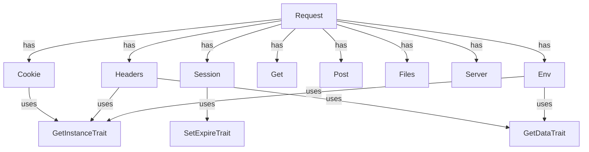

# CloudCastle HttpRequest

[](coverage-report/index.html)
[](https://github.com/zorinalexey/cloud-castle-http-request/actions)
[](https://phpstan.org/)
[](LICENSE)
[](https://packagist.org/packages/cloud-castle/http-request)
---

## Overview
**CloudCastle HttpRequest** is a modern PHP library for safe, convenient, and extensible HTTP request handling: sessions, cookies, files, headers, server and environment variables. It supports automatic JSON/XML parsing, Singleton pattern, magic methods, and is fully covered by tests.

---

## Features
- Unified access to GET, POST, COOKIE, SESSION, FILES, HEADERS, SERVER, ENV
- Automatic JSON/XML body parsing
- Singleton pattern for all components
- Magic methods for easy access
- Helper functions for global usage
- 100% test coverage, static analysis (PHPStan)
- Framework-agnostic (Laravel, Symfony, Slim, etc.)

---

## Requirements
- PHP >= 8.1
- Extensions: ext-json, ext-mbstring

---

## Installation
```bash
composer require cloudcastle/http-request
```

---

## Quick Start
```php
use CloudCastle\HttpRequest\Request;
$request = Request::getInstance();
$userId = $request->get('user_id');
$headers = $request->headers;
$all = $request->all();
```

---

## Architecture (Mermaid)


---

## Usage Examples
### Get/POST/Headers
```php
$request = Request::getInstance();
$name = $request->get('name');
$token = $request->headers->get('Authorization');
```

### Cookies
```php
$cookie = $request->cookie;
$cookie->set('token', 'abc');
```

### Files
```php
$file = $request->files->get('avatar');
if ($file && $file->isUploaded()) {
    $file->save('/uploads/');
}
```

---

## Integration
### Laravel
```php
use CloudCastle\HttpRequest\Request;
$request = Request::getInstance();
```
### Symfony
```php
use CloudCastle\HttpRequest\Request;
$request = Request::getInstance();
```
### Slim
```php
use CloudCastle\HttpRequest\Request;
$app->post('/api', function ($req, $res, $args) {
    $request = Request::getInstance();
    $data = $request->all();
});
```

---

## FAQ
- **How to reset singleton for tests?**  
  Use `resetInstance()` method for the class.
- **How to add a new Content-Type?**  
  Add it to `Request::$contentTypes` array.
- **How to test file uploads?**  
  Use mock objects and override `$_FILES` in tests.

---

## Contributing
- Fork, create a branch, submit a PR
- Follow PSR-12, add tests for new features
- All changes must pass CI/CD
- For bugs, open an issue with details

---

## License
MIT License. See [LICENSE](LICENSE).

---

## Contacts
- Email: [zorinalexey59292@gmail.com](mailto:zorinalexey59292@gmail.com)
- Telegram: [@CloudCastle85](https://t.me/CloudCastle85)
- Issues: https://github.com/zorinalexey/Http-Request/issues 