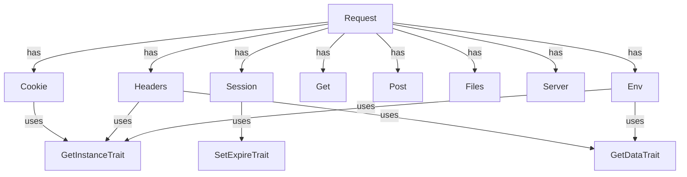

# CloudCastle HttpRequest

[](coverage-report/index.html)
[](https://github.com/zorinalexey/cloud-castle-http-request/actions)
[](https://phpstan.org/)
[](LICENSE)
[](https://packagist.org/packages/cloud-castle/http-request)
---

[Русский](README.md) | [English](README.en.md) | [Deutsch](README.de.md)
---

**CloudCastle HttpRequest** — une bibliothèque PHP moderne pour un travail pratique, sécurisé et extensible avec les requêtes HTTP, les sessions, les cookies, les fichiers, les en-têtes, les variables serveur et l'environnement. Prend en charge l'analyse automatique JSON et XML, le pattern Singleton, les méthodes magiques, les fonctions d'aide globales et est entièrement couverte par des tests.

---

## 🧪 Statistiques des tests et de la couverture

- **PHPUnit** : 163 tests, 194 assertions, 2 ignorés
- **Couverture des lignes** : 90,43% (624 / 690)
- **Couverture des méthodes** : 73,33% (44 / 60)
- **Couverture des classes** : 61,54% (8 / 13)
- **Dernière exécution** : 2025-06-29
- **Temps moyen d'exécution des tests** : ~0,5 sec

<details>
<summary>Couverture par répertoires</summary>

| Répertoire   | Lignes | Méthodes | Classes |
|--------------|--------|----------|---------|
| Http         | 82,79% (101/122) | 83,87% (26/31) | 57,14% (4/7) |
| Server       | 70,83% (17/24)   | 75,00% (3/4)   | 50,00% (1/2) |
| Traits       | 100,00% (17/17)  | 100,00% (6/6)  | 100,00% (3/3) |
| helpers      | 0,00% (0/34)     | 0,00% (0/8)    | — |

## 🧪 Statistiques détaillées de couverture par classe

| Classe                      | Lignes         | Méthodes        | Méthodes publiques | Couverture méthodes |
|-----------------------------|----------------|-----------------|--------------------|---------------------|
| **Cookie**                  | 100% (20/20)   | 100% (7/7)      | 7/7                | 100%                |
| **Get**                     | 100% (4/4)     | 100% (1/1)      | 1/1                | 100%                |
| **Post**                    | 100% (4/4)     | 100% (1/1)      | 1/1                | 100%                |
| **Files**                   | 100% (15/15)   | 100% (1/1)      | 1/1                | 100%                |
| **Headers**                 | 91% (21/23)    | 67% (2/3)       | 2/3                | 67%                 |
| **Session**                 | 78% (25/32)    | 67% (6/9)       | 6/9                | 67%                 |
| **UploadFile**              | 50% (12/24)    | 89% (8/9)       | 8/9                | 89%                 |
| **Server**                  | 100% (4/4)     | 100% (1/1)      | 1/1                | 100%                |
| **Env**                     | 65% (13/20)    | 67% (2/3)       | 2/3                | 67%                 |

**Méthodes publiques non couvertes (voir dashboard.html) :**
- UploadFile::save — 14% couvert
- Session::__set, __get — 0% couvert
- Headers::__construct — 87% couvert (partiellement)
- Env::__set — 53% couvert
- (et d'autres, voir dashboard.html)


</details>

---

## 📎 Liens rapides
- [Documentation](#api-détaillé)
- [Exemples](#exemples-dutilisation)
- [Architecture](#architecture-et-composants)
- [FAQ](#faq-et-dépannage)
- [Changelog](CHANGELOG.md)
- [Issues](https://github.com/zorinalexey/Http-Request/issues)
- [Pull Requests](https://github.com/zorinalexey/Http-Request/pulls)

---

## ⚙️ Exigences
- PHP >= 8.3
- Extensions : ext-json, ext-mbstring
- Compatibilité : tout framework, support PSR-4

---

## 🚀 CI/CD Workflow (GitHub Actions)
```yaml
name: CI

on:
  push:
    branches: [ main, master ]
  pull_request:
    branches: [ main, master ]

jobs:
  build:
    runs-on: ubuntu-latest
    strategy:
      matrix:
        php-version: [ '8.3', '8.4' ]
    steps:
      - name: Checkout code
        uses: actions/checkout@v4

      - name: Set up PHP
        uses: shivammathur/setup-php@v2
        with:
          php-version: ${{ matrix.php-version }}
          extensions: mbstring, xml, simplexml, curl, json, session
          coverage: xdebug

      - name: Install dependencies
        run: composer install --no-interaction

      - name: Run tests
        run: composer test

      - name: Run static analysis
        run: composer phpstan

      - name: Coverage (text)
        run: composer coverage

      - name: Coverage (HTML)
        run: composer coverage-html

      - name: Generate documentation
        run: composer docs-gen

      - name: Upload coverage report
        uses: actions/upload-artifact@v4
        with:
          name: coverage-report
          path: coverage-report/

      - name: Upload documentation
        uses: actions/upload-artifact@v4
        with:
          name: documentation
          path: build/api/ 
```

---

## 🗺️ Architecture (Mermaid)


---

## 📋 Sommaire
- [Fonctionnalités](#fonctionnalités)
- [Installation](#installation)
- [Démarrage rapide](#démarrage-rapide)
- [Architecture et composants](#architecture-et-composants)
- [API détaillé](#api-détaillé)
- [Exemples d'utilisation](#exemples-dutilisation)
- [Fonctions d'aide](#fonctions-daide)
- [Intégration framework](#intégration-avec-des-frameworks)
- [Tests](#tests)
- [FAQ](#faq)
- [Licence et contacts](#licence-et-contacts)

---

## 🚀 Fonctionnalités
- Accès universel aux données de la requête : GET, POST, COOKIE, SESSION, FILES, HEADERS, SERVER, ENV
- Analyse automatique du corps de la requête JSON et XML
- Gestion pratique des cookies et des sessions (Singleton, chaînage de méthodes, sérialisation)
- Gestion sécurisée des fichiers téléchargés
- Fonctions globales pour un accès rapide aux données
- Configuration flexible de la durée de vie des sessions et des cookies
- Compatible avec les standards PHP modernes (8.3+)
- Entièrement couvert par des tests (PHPUnit)
- Extensible et intégrable à tout framework

---

## 📦 Installation

### Via Composer (recommandé)
```bash
composer require cloud-castle/http-request
```

### Installation manuelle
```bash
git clone https://github.com/zorinalexey/cloud-castle-http-request
cd http-request
composer install
```

---

## ⚡ Démarrage rapide

```php
<?php
require_once 'vendor/autoload.php';

use CloudCastle\HttpRequest\Request;

// Obtenir le singleton Request
$request = Request::getInstance();

// Obtenir les paramètres de la requête
$userId = $request->get('user_id');
$session = $request->session;
$all = $request->all();

// Obtenir POST/GET/COOKIE/FILES/HEADERS
$post = $request->post;
$get = $request->get;
$cookie = $request->cookie;
$files = $request->files;
$headers = $request->headers;
```

---

## 🏗️ Architecture et composants

- **Request** — façade principale pour accéder à toutes les données de la requête.
- **Get/Post** — accès aux données GET/POST.
- **Cookie** — gestion des cookies (définir, obtenir, supprimer, vider).
- **Session** — gestion des sessions.
- **Files/UploadFile** — gestion des fichiers téléchargés.
- **Headers** — gestion des en-têtes HTTP.
- **Server/Env** — accès aux variables serveur et d'environnement.
- **Fonctions d'aide** : `request()`, `cookies()`, `session()`, `files()`, `headers()`, `get()`, `post()`, `env()`.

---

## 📚 API détaillé

### Request
| Méthode                | Description                                   |
|-----------------------|-----------------------------------------------|
| getInstance()         | Obtenir le singleton Request                  |
| init($sess, $cook)    | Initialiser avec TTL pour session et cookie   |
| get($key, $def)       | Obtenir un paramètre par clé                  |
| all()                 | Obtenir toutes les données de la requête      |
| __get($name)          | Accès magique aux composants                  |

### Cookie
| Méthode                | Description                                   |
|-----------------------|-----------------------------------------------|
| set($key, $val)       | Définir un cookie                             |
| get($key, $def)       | Obtenir un cookie                             |
| delete($key)          | Supprimer un cookie                           |
| clear()               | Vider tous les cookies                        |

### Session
| Méthode                | Description                                   |
|-----------------------|-----------------------------------------------|
| set($key, $val)       | Définir une valeur dans la session            |
| get($key, $def)       | Obtenir une valeur de la session              |
| delete($key)          | Supprimer une valeur de la session            |
| clear()               | Vider la session                              |

### Files/UploadFile
| Méthode                | Description                                   |
|-----------------------|-----------------------------------------------|
| get($name)            | Obtenir un fichier par nom                    |
| all()                 | Obtenir tous les fichiers                     |
| isUploaded()          | Vérifier si le fichier a été téléchargé       |
| save($path)           | Enregistrer le fichier                        |
| getOriginalName()     | Nom original du fichier                       |
| getSize()             | Taille du fichier                             |
| getMimeType()         | Type MIME du fichier                          |
| getExtension()        | Extension du fichier                          |

### Headers
| Méthode                | Description                                   |
|-----------------------|-----------------------------------------------|
| get($name, $def)      | Obtenir un en-tête                            |
| all()                 | Obtenir tous les en-têtes                     |
| __set($name, $val)    | Définir un en-tête                            |

### Server/Env
| Méthode                | Description                                   |
|-----------------------|-----------------------------------------------|
| get($name, $def)      | Obtenir une variable serveur/environnement    |
| all()                 | Obtenir toutes les variables                   |

---

## 💡 Exemples d'utilisation

### Fonction globale `request()`
```php
// Obtenir un paramètre de n'importe quelle source (GET, POST, ...), ou l'objet Request
$id = request('id');
$name = request('name', 'default_name');
$request = request();

// Obtenir toutes les données de la requête
$all = request()->all();

// Gestion des fichiers
$avatar = request()->files('avatar');
if ($avatar && $avatar->isUploaded()) {
    $avatar->save('/uploads/avatars/');
}

// Gestion des cookies
request()->cookie->set('token', 'abc123');
$token = request()->cookie->get('token');

// Gestion de la session
request()->session->set('user_id', 42);
$userId = request()->session->get('user_id');
```

### Gestion des en-têtes
```php
$headers = request()->headers;
$userAgent = $headers->get('User-Agent');
$headers->X_Custom_Header = 'custom_value';
```

### Gestion du JSON et XML
```php
// Si Content-Type: application/json
$data = request()->all(); // converti automatiquement en tableau

// Si Content-Type: application/xml
$data = request()->all(); // converti automatiquement en tableau
```

### Gestion de GET/POST
```php
$get = request()->get;
$post = request()->post;

$name = $get->get('name');
$email = $post->get('email');
```

### Gestion des variables serveur et d'environnement
```php
$server = request()->server;
$env = request()->env;

$host = $server->get('HTTP_HOST');
$phpVersion = $env->get('PHP_VERSION');
```

### Gestion de UploadFile
```php
$file = request()->files('avatar');
if ($file && $file->isUploaded()) {
    $file->save('/uploads/avatars/');
    echo $file->getOriginalName();
    echo $file->getSize();
    echo $file->getMimeType();
}
```

---

## 🛠️ Fonctions d'aide

- `request($key = null, $default = null)` — accès universel aux données de la requête
- `cookies($key = null, $default = null)` — accès aux cookies
- `session($key = null, $default = null)` — accès à la session
- `files($key = null)` — accès aux fichiers téléchargés
- `headers($key = null, $default = null)` — accès aux en-têtes
- `get($key = null, $default = null)` — accès à GET
- `post($key = null, $default = null)` — accès à POST
- `env($key = null, $default = null)` — accès aux variables d'environnement

---

## 🌐 Intégration avec des frameworks
### Laravel
```php
use CloudCastle\HttpRequest\Request;
$request = Request::getInstance();
$userId = $request->get('user_id');
```

### Symfony
```php
use CloudCastle\HttpRequest\Request;
$request = Request::getInstance();
$headers = $request->headers;
```

### Slim
```php
use CloudCastle\HttpRequest\Request;
$app->post('/api', function ($req, $res, $args) {
    $request = Request::getInstance();
    $data = $request->all();
    // ...
});
```

---

## 🧪 Tests

```bash
composer install
vendor/bin/phpunit --testdox
```

---

## ❓ FAQ et Dépannage
- **Q :** Pourquoi les nouvelles variables d'environnement ne sont-elles pas visibles ?  
  **R :** Utilisez `$env->get('VAR')` après l'avoir définie, assurez-vous que la variable est dans $_ENV.
- **Q :** Comment ajouter la prise en charge d'un nouveau Content-Type ?  
  **R :** Ajoutez-le au tableau `Request::$contentTypes`.
- **Q :** Comment tester le téléchargement de fichiers ?  
  **R :** Utilisez des objets mock et remplacez $_FILES dans les tests.
- **Q :** Comment réinitialiser le singleton ?  
  **R :** Utilisez la méthode `resetInstance()` pour la classe souhaitée.

---

## 🚦 Performance & Sécurité
- Utilisez HTTPS pour travailler avec les cookies et les sessions.
- Ne stockez pas de données sensibles dans les cookies.
- Désactivez les erreurs détaillées en production.
- Utilisez l'analyse statique et la couverture des tests pour améliorer la qualité.

---

## 🤝 Contribuer
- Forkez le dépôt, créez une branche, soumettez une PR.
- Respectez PSR-12, écrivez des tests pour les nouvelles fonctionnalités.
- Tous les changements doivent passer le CI/CD.
- Pour les bugs — créez un issue avec une description détaillée.

---

## 📝 Changelog
Voir [CHANGELOG.md](CHANGELOG.md) pour l'historique des modifications.

---

## 📬 Contacts et support
- Email : [zorinalexey59292@gmail.com](mailto:zorinalexey59292@gmail.com)
- Telegram : [@CloudCastle85](https://t.me/CloudCastle85)
- Issues : https://github.com/zorinalexey/Http-Request/issues

---

## 📄 Licence
Licence MIT. Voir le fichier [LICENSE](LICENSE).

---

## 📝 Licence et contacts

MIT © Alexey Zorin ([zorinalexey59292@gmail.com](mailto:zorinalexey59292@gmail.com))

- [Projet GitHub](https://github.com/zorinalexey/cloud-castle-http-request)
- [Questions et suggestions](mailto:zorinalexey59292@gmail.com)

---

**CloudCastle HttpRequest** — votre outil universel pour travailler avec HTTP en PHP ! 