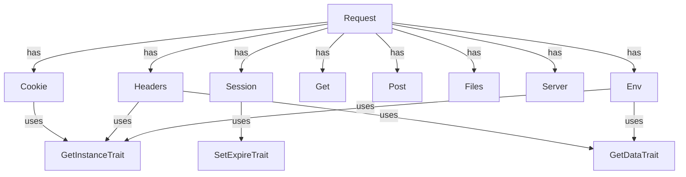

# CloudCastle HttpRequest

[English](README.en.md) | [Deutsch](README.de.md)

[](coverage-report/index.html)
[](https://github.com/zorinalexey/cloud-castle-http-request/actions)
[](https://phpstan.org/)
[](LICENSE)
[](https://packagist.org/packages/cloud-castle/http-request)
---

**CloudCastle HttpRequest** — современная PHP-библиотека для удобной, безопасной и расширяемой работы с HTTP-запросами, сессиями, cookie, файлами, заголовками, серверными переменными и окружением. Поддерживает автоматический разбор JSON и XML, паттерн Singleton, магические методы, глобальные вспомогательные функции и полностью покрыта тестами.

---

## 📎 Быстрые ссылки
- [Документация](#подробное-api)
- [Примеры](#примеры-использования)
- [Архитектура](#архитектура-и-компоненты)
- [FAQ](#faq-и-troubleshooting)
- [Changelog](CHANGELOG.md)
- [Issues](https://github.com/zorinalexey/Http-Request/issues)
- [Pull Requests](https://github.com/zorinalexey/Http-Request/pulls)

---

## ⚙️ Требования
- PHP >= 8.1
- Расширения: ext-json, ext-mbstring
- Совместимость: любой фреймворк, поддержка PSR-4

---

## 🚀 CI/CD Workflow (GitHub Actions)
```yaml
name: CI
on: [push, pull_request]
jobs:
  build:
    runs-on: ubuntu-latest
    steps:
      - uses: actions/checkout@v3
      - name: Setup PHP
        uses: shivammathur/setup-php@v2
        with:
          php-version: '8.1'
          extensions: mbstring, json
      - name: Install dependencies
        run: composer install --no-interaction
      - name: Run tests
        run: composer test
      - name: Run static analysis
        run: composer phpstan
      - name: Coverage (text)
        run: composer coverage
      - name: Coverage (HTML)
        run: composer coverage-html
```

---

## 🗺️ Архитектура (Mermaid)


---

## 📋 Содержание
- [Возможности](#возможности)
- [Установка](#установка)
- [Быстрый старт](#быстрый-старт)
- [Архитектура и компоненты](#архитектура-и-компоненты)
- [Подробное API](#подробное-api)
- [Примеры использования](#примеры-использования)
- [Вспомогательные функции](#вспомогательные-функции)
- [Интеграция с фреймворками](#интеграция-с-фреймворками)
- [Тестирование](#тестирование)
- [FAQ](#faq)
- [Лицензия и контакты](#лицензия-и-контакты)

---

## 🚀 Возможности
- Универсальный доступ к данным запроса: GET, POST, COOKIE, SESSION, FILES, HEADERS, SERVER, ENV
- Автоматический разбор JSON и XML тела запроса
- Удобная работа с cookie и сессиями (Singleton, цепочки вызовов, сериализация)
- Безопасная работа с загруженными файлами
- Глобальные функции для быстрого доступа к данным
- Гибкая настройка времени жизни сессий и cookie
- Совместимость с современными стандартами PHP (8.1+)
- Полное покрытие тестами (PHPUnit)
- Расширяемость и интеграция с любыми фреймворками

---

## 📦 Установка

### Через Composer (рекомендуется)
```bash
composer require cloud-castle/http-request
```

### Ручная установка
```bash
git clone https://github.com/zorinalexey/cloud-castle-http-request
cd http-request
composer install
```

---

## ⚡ Быстрый старт

```php
<?php
require_once 'vendor/autoload.php';

use CloudCastle\HttpRequest\Request;

// Получить singleton Request
$request = Request::getInstance();

// Получить параметры запроса
$userId = $request->get('user_id');
$session = $request->session;
$all = $request->all();

// Получить POST/GET/COOKIE/FILES/HEADERS
$post = $request->post;
$get = $request->get;
$cookie = $request->cookie;
$files = $request->files;
$headers = $request->headers;
```

---

## 🏗️ Архитектура и компоненты

- **Request** — основной фасад для доступа ко всем данным запроса.
- **Get/Post** — доступ к GET/POST данным.
- **Cookie** — управление cookie (установка, получение, удаление, очистка).
- **Session** — управление сессиями.
- **Files/UploadFile** — работа с загруженными файлами.
- **Headers** — работа с HTTP-заголовками.
- **Server/Env** — доступ к серверным переменным и окружению.
- **Вспомогательные функции**: `request()`, `cookies()`, `session()`, `files()`, `headers()`, `get()`, `post()`, `env()`.

---

## 📚 Подробное API

### Request
| Метод                | Описание                                      |
|----------------------|-----------------------------------------------|
| getInstance()        | Получить singleton Request                    |
| init($sess, $cook)   | Инициализация с TTL для сессии и cookie       |
| get($key, $def)      | Получить параметр по ключу                    |
| all()                | Получить все данные запроса                   |
| __get($name)         | Магический доступ к компонентам               |

### Cookie
| Метод                | Описание                                      |
|----------------------|-----------------------------------------------|
| set($key, $val)      | Установить cookie                             |
| get($key, $def)      | Получить cookie                               |
| delete($key)         | Удалить cookie                                |
| clear()              | Очистить все cookie                           |

### Session
| Метод                | Описание                                      |
|----------------------|-----------------------------------------------|
| set($key, $val)      | Установить значение в сессию                  |
| get($key, $def)      | Получить значение из сессии                   |
| delete($key)         | Удалить значение из сессии                    |
| clear()              | Очистить сессию                               |

### Files/UploadFile
| Метод                | Описание                                      |
|----------------------|-----------------------------------------------|
| get($name)           | Получить файл по имени                        |
| all()                | Получить все файлы                            |
| isUploaded()         | Проверить, был ли файл загружен               |
| save($path)          | Сохранить файл                                |
| getOriginalName()    | Оригинальное имя файла                        |
| getSize()            | Размер файла                                  |
| getMimeType()        | MIME-тип файла                                |
| getExtension()       | Расширение файла                              |

### Headers
| Метод                | Описание                                      |
|----------------------|-----------------------------------------------|
| get($name, $def)     | Получить заголовок                            |
| all()                | Получить все заголовки                        |
| __set($name, $val)   | Установить заголовок                          |

### Server/Env
| Метод                | Описание                                      |
|----------------------|-----------------------------------------------|
| get($name, $def)     | Получить переменную сервера/окружения         |
| all()                | Получить все переменные                       |

---

## 💡 Примеры использования

### Глобальная функция `request()`
```php
// Получить параметр из любого источника (GET, POST, ...), либо объект Request
$id = request('id');
$name = request('name', 'default_name');
$request = request();

// Получить все данные запроса
$all = request()->all();

// Работа с файлами
$avatar = request()->files('avatar');
if ($avatar && $avatar->isUploaded()) {
    $avatar->save('/uploads/avatars/');
}

// Работа с cookie
request()->cookie->set('token', 'abc123');
$token = request()->cookie->get('token');

// Работа с сессией
request()->session->set('user_id', 42);
$userId = request()->session->get('user_id');
```

### Работа с заголовками
```php
$headers = request()->headers;
$userAgent = $headers->get('User-Agent');
$headers->X_Custom_Header = 'custom_value';
```

### Работа с JSON и XML
```php
// Если Content-Type: application/json
$data = request()->all(); // автоматически преобразуется в массив

// Если Content-Type: application/xml
$data = request()->all(); // автоматически преобразуется в массив
```

### Работа с GET/POST
```php
$get = request()->get;
$post = request()->post;

$name = $get->get('name');
$email = $post->get('email');
```

### Работа с серверными переменными и окружением
```php
$server = request()->server;
$env = request()->env;

$host = $server->get('HTTP_HOST');
$phpVersion = $env->get('PHP_VERSION');
```

### Работа с UploadFile
```php
$file = request()->files('avatar');
if ($file && $file->isUploaded()) {
    $file->save('/uploads/avatars/');
    echo $file->getOriginalName();
    echo $file->getSize();
    echo $file->getMimeType();
}
```

---

## 🛠️ Вспомогательные функции

- `request($key = null, $default = null)` — универсальный доступ к данным запроса
- `cookies($key = null, $default = null)` — доступ к cookie
- `session($key = null, $default = null)` — доступ к сессии
- `files($key = null)` — доступ к загруженным файлам
- `headers($key = null, $default = null)` — доступ к заголовкам
- `get($key = null, $default = null)` — доступ к GET
- `post($key = null, $default = null)` — доступ к POST
- `env($key = null, $default = null)` — доступ к переменным окружения

---

## 🌐 Интеграция с фреймворками
### Laravel
```php
use CloudCastle\HttpRequest\Request;
$request = Request::getInstance();
$userId = $request->get('user_id');
```

### Symfony
```php
use CloudCastle\HttpRequest\Request;
$request = Request::getInstance();
$headers = $request->headers;
```

### Slim
```php
use CloudCastle\HttpRequest\Request;
$app->post('/api', function ($req, $res, $args) {
    $request = Request::getInstance();
    $data = $request->all();
    // ...
});
```

---

## 🧪 Тестирование

```bash
composer install
vendor/bin/phpunit --testdox
```

---

## ❓ FAQ и Troubleshooting
- **Q:** Почему не видны новые переменные окружения?  
  **A:** Используйте `$env->get('VAR')` после установки, убедитесь, что переменная есть в $_ENV.
- **Q:** Как добавить поддержку нового Content-Type?  
  **A:** Добавьте его в массив `Request::$contentTypes`.
- **Q:** Как протестировать загрузку файлов?  
  **A:** Используйте мок-объекты и подмену $_FILES в тестах.
- **Q:** Как сбросить singleton?  
  **A:** Используйте метод `resetInstance()` для нужного класса.

---

## 🚦 Performance & Security
- Используйте HTTPS для работы с cookie и сессиями.
- Не храните чувствительные данные в cookie.
- Для production отключайте подробные ошибки.
- Используйте статический анализ и покрытие тестами для повышения качества.

---

## 🤝 Contributing
- Форкните репозиторий, создайте ветку, отправьте PR.
- Соблюдайте PSR-12, пишите тесты для новых фич.
- Все изменения должны проходить CI/CD.
- Для багов — создавайте issue с подробным описанием.

---

## 📝 Changelog
Смотрите [CHANGELOG.md](CHANGELOG.md) для истории изменений.

---

## 📬 Контакты и поддержка
- Email: [zorinalexey59292@gmail.com](mailto:zorinalexey59292@gmail.com)
- Telegram: [@CloudCastle85](https://t.me/CloudCastle85)
- Issues: https://github.com/zorinalexey/Http-Request/issues

---

## 📄 Лицензия
MIT License. См. файл [LICENSE](LICENSE).

---

## 🌍 English version
See [README.en.md](README.en.md) for English documentation (coming soon).

---

## 📝 Лицензия и контакты

MIT © Алексей Зорин ([zorinalexey59292@gmail.com](mailto:zorinalexey59292@gmail.com))

- [GitHub проекта](https://github.com/zorinalexey/cloud-castle-http-request)
- [Вопросы и предложения](mailto:zorinalexey59292@gmail.com)

---

**CloudCastle HttpRequest** — ваш универсальный инструмент для работы с HTTP в PHP! 